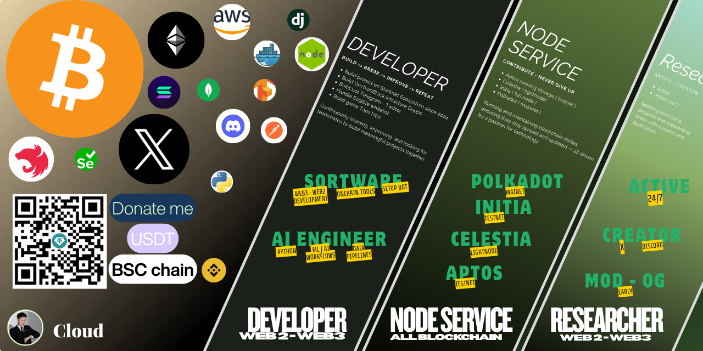

<h1 align="center">Hi 👋, I'm Do Van Thang</h1>

  Data Engineer • Backend Developer • Blockchain / Onchain Tools • Researcher

  
  
  
  

  

---

## About me
**Computer Science** graduate with distinction from [Industrial University of Ho Chi Minh City (IUH)](https://en.wikipedia.org/wiki/Industrial_University_of_Ho_Chi_Minh_City), Vietnam.

I work as a **Data Engineer & Backend Developer** in blockchain-related technology, with a focus on on-chain automation, backend infrastructure, data pipelines, and applied research.

Since 2022, I have been active in financial markets, developing a research-driven approach to execution, risk management, and market systems.

Currently building **Grindy Technology** and exploring blockchain infrastructure, distributed systems, and scalable data platforms.

**Technical areas:** Data Engineering · Backend Development · Blockchain Infrastructure · On-chain Automation · Node Operations · Validators · Devnet/Testnet/Mainnet

---

## What I Do

### ⚙️ Data Engineering & Infrastructure

* Build reliable batch and streaming data pipelines, ETL/ELT workflows, and cost-aware data architectures
* Design scalable data models, optimize query performance, and improve system observability through logs, metrics, and traces
* Develop monitoring, alerting, and automation workflows for production-grade data systems

### 🧩 Backend Systems & APIs

* Design modular backend services using clean architecture, authentication, caching, rate limiting, and job queues
* Build production-ready APIs for blockchain, fintech, analytics, and marketplace workflows
* Develop backend systems for indexing, transaction pipelines, wallet analytics, user activity tracking, and automation tools

### 🔗 Blockchain, Onchain Tools & Node Operations

* Build tools for transaction tracking, wallet and contract analytics, alerting systems, and onchain automation
* Research and develop pipelines for airdrop, retroactive, user segmentation, and onchain signal analysis
* Operate and maintain blockchain infrastructure including light nodes, full nodes, storage nodes, validators, devnets, testnets, and mainnet validators

### 🏛️ RWA, Marketplace & Web3 Products

* Explore and build Web3 marketplace systems, including asset listing, user flows, indexing, and transaction automation
* Work on RWA-related concepts such as asset tokenization, ownership records, marketplace infrastructure, and onchain/offchain data integration
* Turn blockchain data, financial logic, and product requirements into practical tools, dashboards, and backend systems

### 🔐 Privacy & Smart Contract Development

* Interested in privacy-preserving systems, secure data flows, and privacy-focused blockchain applications
* Write and understand smart contracts using Solidity for EVM-based ecosystems
* Familiar with Rust for blockchain infrastructure, backend services, automation tools, and performance-oriented systems

### 🔬 Research & Product Development

* Deep-dive into protocols, ecosystems, tokenomics, infrastructure, and emerging Web3 trends
* Write technical summaries, validate ideas, and build proof-of-concepts quickly
* Convert research insights into usable products such as dashboards, scrapers, indexers, automation bots, and internal tools

---

## Tech Stack

**Backend:** Node.js, NestJS, Express, Python (Flask/Django)  
**Blockchain & Smart Contracts**: Solidity, Rust, EVM, Web3.js, Ethers.js, smart contract development  
**Data:** PostgreSQL, MySQL, MongoDB, MS SQL, Pandas, Hadoop  
**Infra:** Docker, Nginx, Linux, AWS, GCP, Azure, Firebase  
**Monitoring & Observability**: Grafana, logs, metrics  
**Tools:** Git, GraphQL, Postman  

                                     

<!-- Solidity -->  <!-- Rust -->  <!-- EVM / Ethereum Virtual Machine -->  <!-- Web3.js -->  <!-- Ethers.js -->  <!-- Smart Contract Development --> 

---

## Connect with me

- 🐦 Twitter: https://twitter.com/cloudtechvn
- 💼 LinkedIn: https://linkedin.com/in/stevendo0807/  
- 💬 Telegram: https://t.me/StevenDo_OnchainBlock  
- 🌐 Portfolio: https://www.cloudlabs.id.vn/
- 📫 Email: Dovanthang08072k@gmail.com  

---

## Stats

  

---

